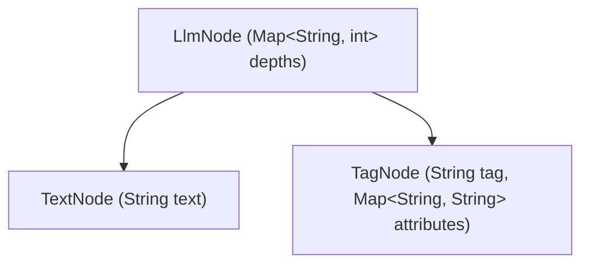

# LLM Tag Parser Specifications (v2) - Chronological Event Stream & Instance Isolation

## Overview

`llm_tag_parser` is a stream-aware tag parser for LLM response streams. In v2, the parser is architected around a **unified chronological event stream of structured nodes** (`LlmNode`). 

Instead of treating the LLM stream as a multiplexer that blindly splits text into parallel streams, the parser parses incoming chunks into a single chronological timeline. This enables **true instance isolation** for multiple occurrences of the same tag, preserves the exact chronological order of plain text and tag blocks, and provides a clean, reactive filtering API.

---

## The Unified Event Stream (`LlmNode`)

The core of `llm_tag_parser` is the chronological node stream:
```dart
Stream<LlmNode> get nodes;
```

Every parsed chunk or block is represented as a subclass of `LlmNode`. Each node captures the active **tag nesting depths** at the moment it was emitted, allowing perfect nested filtering.



### 1. `TextNode` (Conversational Text)
Represents a segment of plain, untagged conversational text.
* `text`: The raw text chunk.
* `depths`: Snapshot of active tag nesting depths.

### 2. `TagNode` (Isolated Tag Instance)
Represents a single, specific occurrence of a matched tag (e.g. a specific `<interface>` block). It is emitted the **instant** the opening tag is fully parsed.
* `tag`: The registered tag string prefix (e.g., `<interface {attrs}>`).
* `attributes`: The parsed key-value attributes for this specific instance.
* `stream`: An **isolated, private `Stream<String>`** that emits text inside *only this specific occurrence*.
* `future`: A **`Future<String>`** that completes with the full accumulated content of *only this specific occurrence*.

---

## Conceptual Data Flow

For the following stream output:
```
Here is your panel:
<interface id="panel-1">Content A</interface>
And another:
<interface id="panel-2">Content B</interface>
Done!
```

The unified stream `parser.nodes` emits the following elements in **exact chronological order**:

1. **`TextNode`**: `"Here is your panel:\n"` (depths: `{}`)
2. **`TagNode`**: `tag: "<interface {attrs}>"`, `attributes: {"id": "panel-1"}`
   * *This `TagNode`'s internal isolated `stream` emits `"Content A"` chunk-by-chunk.*
3. **`TextNode`**: `"\nAnd another:\n"` (depths: `{}`)
4. **`TagNode`**: `tag: "<interface {attrs}>"`, `attributes: {"id": "panel-2"}`
   * *This `TagNode`'s internal isolated `stream` emits `"Content B"` chunk-by-chunk.*
5. **`TextNode`**: `"\nDone!"` (depths: `{}`)

---

## Reactive Filtering API

By treating everything as simple filters over `Stream<LlmNode>`, high-level routing becomes extremely elegant, performant, and declarative.

### 1. True Instance Routing (`instances`)
To process multiple identical tags without any cross-leakage or multiplexing issues:

```dart
parser.within('<interface {attrs}>').instances.listen((instance) async {
  // Inspect this instance's attributes directly
  final id = await instance.getAttributeFuture('id'); // e.g. "panel-1"

  // Feed this instance's isolated stream directly into a nested parser!
  final jsonStream = JsonStreamParser(instance.stream);
  ui.displayJsonUi(id, jsonStream);
});
```

### 2. Backward-Compatible Multiplexed Streams
For backward compatibility, the traditional `.within()` and `.outside()` methods remain available and operate seamlessly on top of the node stream:

```dart
// Emits conversational text (outside <interface> blocks)
parser.outside('<interface {attrs}>').stream.listen((text) => print(text));

// Emits content inside ANY <interface> block (multiplexed)
parser.within('<interface {attrs}>').stream.listen((text) => print(text));
```

---

## Technical Specifications

### Tag Formats & Delimiter Parsing
- Tags must be declared upfront in `LlmTagParser(stream: ..., tags: [...])`.
- Custom placeholders (like `LlmTag(open: '<interface|||>', close: '</interface>').withAttributes('|||')`) are fully supported.
- Supported attribute formats include `AttributeFormat.xml` (default) and `AttributeFormat.keyOnly`.

### Nested Tags Routing
- Active instances are tracked in a stack inside the parser.
- When nested tags occur (e.g. `<tool_use>` inside `<thinking>`), text chunks are routed to **all active controllers in the stack**, ensuring parent instances include their children's content.

### Late / Multiple Subscribers
- `parser.nodes` is a replayable stream using `Stream.multi`, ensuring late subscribers receive all previously buffered nodes.
- Each `TagNode`'s private `stream` supports late subscription by replay-buffering its own chunks.
